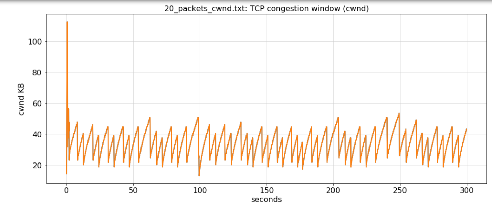
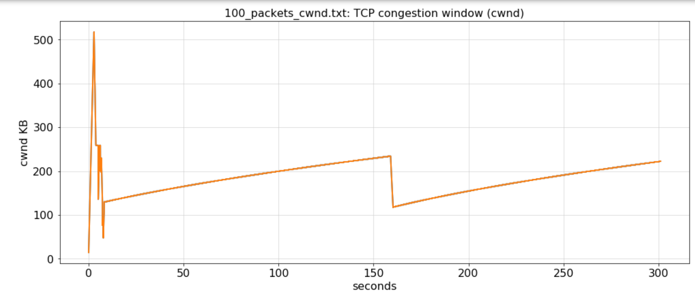
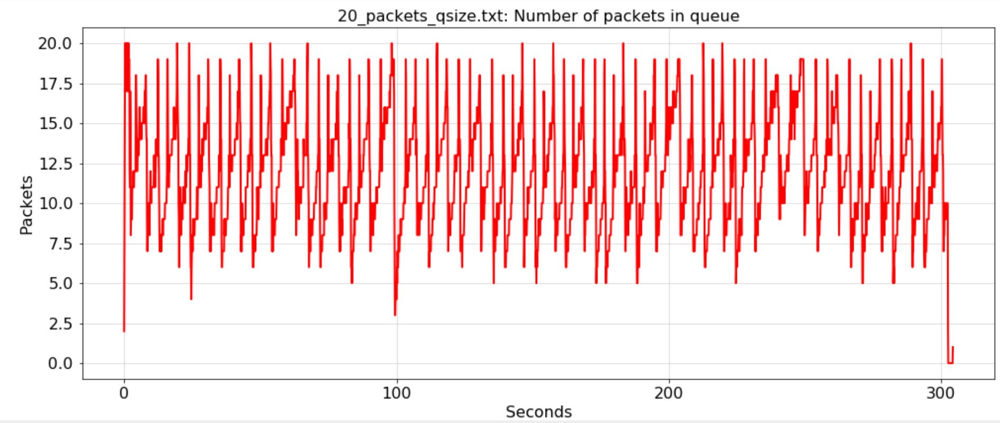
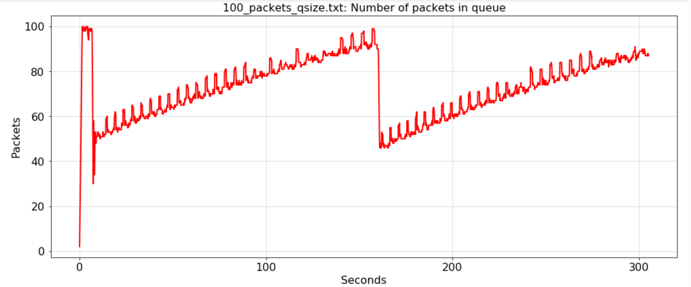
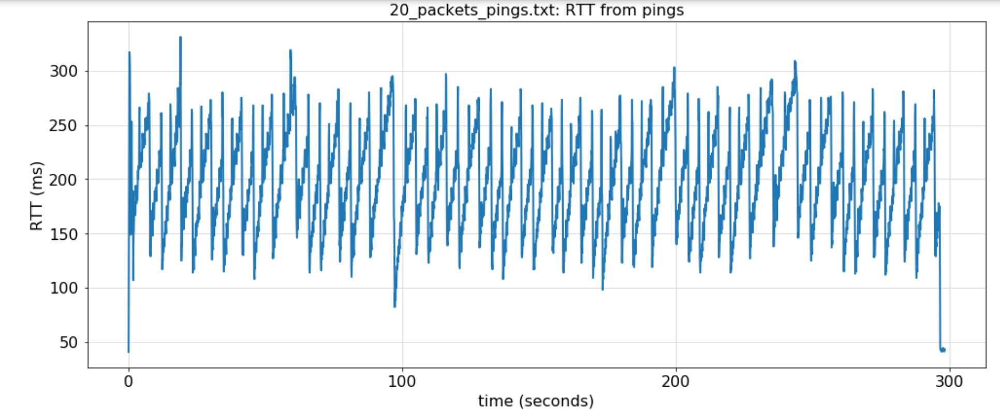
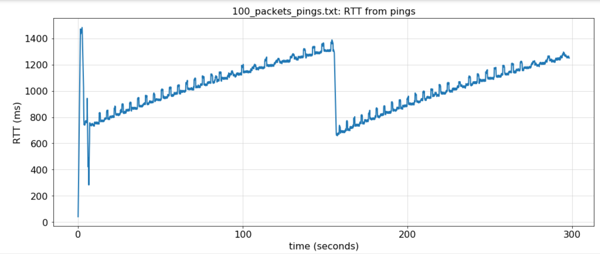
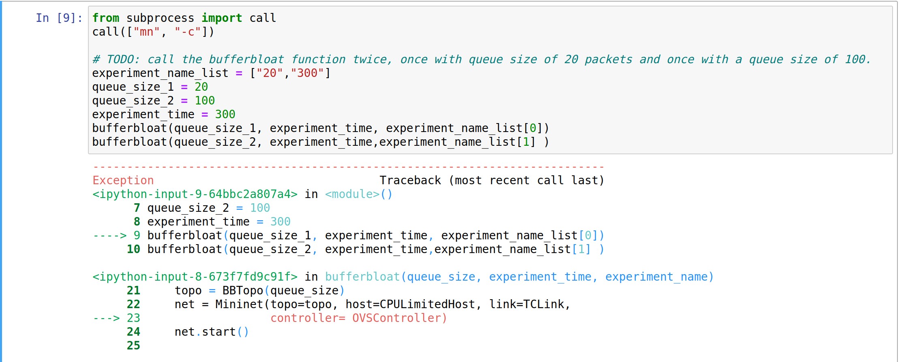

<h1><center>计算机网络实验报告
</h1>

<h2><center>实验二 TCP拥塞控制和缓冲区膨胀

<h3><center>10222140408   谷杰

<h3>一、代码实现过程

``````python
from mininet.topo import Topo

class BBTopo(Topo):
    "Simple topology for bufferbloat experiment."

    def __init__(self, queue_size):
        super(BBTopo, self).__init__()
        
        # Create switch s0 (the router)
        s0 = self.addSwitch('s0')
        
        # TODO: Create two hosts with names 'h1' and 'h2'
        h1 = self.addHost('h1')
        h2 = self.addHost('h2')


        
        # TODO: Add links with appropriate bandwidth, delay, and queue size parameters. 
        #       Set the router queue size using the queue_size argument
        #       Set bandwidths/latencies using the bandwidths and minimum RTT given in the network diagram above
        self.addLink( h1, s0, bw=125, delay='10ms', max_queue_size=queue_size)
        self.addLink( h2, s0, bw=1.5, delay='10ms', max_queue_size=queue_size)
        
        return
``````

​	上述代码先创建一个名为 's0' 的交换机，它在该拓扑中代表路由器。再创建了俩个名为’h1'和‘h2’的主机，并分别与s0添加链路。由于h1 和 h2 之间的往返传播延迟或最小 RTT 为 20ms，故将时延设为10ms。同时还要注意1Gb/s换算成Mb/s应是125Mb/s。

``````python
def start_iperf(net, experiment_time):
    # Start a TCP server on host 'h2' using perf. 
    # The -s parameter specifies server mode
    # The -w 16m parameter ensures that the TCP flow is not receiver window limited (not necessary for client)
    print "Starting iperf server"
    h2 = net.get('h2')
    server = h2.popen("iperf -s -w 16m", shell=True)
    
    # TODO: Start an TCP client on host 'h1' using iperf. 
    #       Ensure that the client runs for experiment_time seconds
    print "Starting iperf client"
    h1 = net.get('h1')
    client = h1.popen("iperf -c {server_ip} -t {time}".format(server_ip=h2.IP(),time=experiment_time), shell=True)
``````

​	这段代码定义了一个函数，用于在 Mininet 中启动 iperf 服务器和客户端，以便进行网络性能测试。iperf 是一个用于测量网络带宽的工具，通过启动服务器和客户端来模拟数据传输，并提供有关网络性能的统计信息。在这里，iperf 服务器在 'h2' 主机上运行，而客户端在 'h1' 主机上运行，并运行指定时间的性能测试。

```python
from mininet.node import CPULimitedHost, OVSController
from mininet.link import TCLink
from mininet.net import Mininet
from mininet.log import lg, info
from mininet.util import dumpNodeConnections

from time import time
import os
from subprocess import call

def bufferbloat(queue_size, experiment_time, experiment_name):
    # Don't forget to use the arguments!
    
    # Set the cwnd control algorithm to "reno" (half cwnd on 3 duplicate acks)
    #    Modern Linux uses CUBIC-TCP by default that doesn't have the usual sawtooth
    #    behaviour.  For those who are curious, replace reno with cubic
    #    see what happens...
    os.system("sysctl -w net.ipv4.tcp_congestion_control=reno")
    
    # create the topology and network
    topo = BBTopo(queue_size)
    net = Mininet(topo=topo, host=CPULimitedHost, link=TCLink, 
                  controller= OVSController)
    net.start()

    # Print the network topology 
    dumpNodeConnections(net.hosts)
    
    # Performs a basic all pairs ping test to ensure the network set up properly
    net.pingAll()
    
    # Start monitoring TCP cwnd size
    outfile = "{}_cwnd.txt".format(experiment_name)
    start_tcpprobe(outfile)

    # TODO: Start monitoring the queue sizes with the start_qmon() function.
    #       Fill in the iface argument with "s0-eth2" if the link from s0 to h2
    #       is added second in BBTopo or "s0-eth1" if the link from s0 to h2
    #       is added first in BBTopo. This is because we want to measure the 
    #       number of packets in the outgoing queue from s0 to h2. 
    outfile = "{}_qsize.txt".format(experiment_name)
    qmon = start_qmon(iface="s0-eth2", outfile=outfile)

    # TODO: Start the long lived TCP connections with the start_iperf() function
    start_iperf(net, experiment_time)
    
    # TODO: Start pings with the start_ping() function
    outfile = "{}_pings.txt".format(experiment_name)
    start_ping(net, outfile)
    
    # TODO: Start the webserver with the start_webserver() function
    start_webserver(net)
    
    # TODO: Measure and print website download times with the fetch_webserver() function
    fetch_webserver(net, experiment_time)
    
    # Stop probing 
    stop_tcpprobe()
    qmon.terminate()
    net.stop()
    
    # Ensure that all processes you create within Mininet are killed.
    Popen("pgrep -f webserver.py | xargs kill -9", shell=True).wait()
    call(["mn", "-c"])
```

​	这段代码主要完成了创建 BBTopo 对象、启动 TCP 和队列监视器、使用iperf启动一个长时期的TCP流、启动 ping序列、启动网络服务器、定期从 h1 下载 index.html 网页并测量获取它需要多长时间，我主要完成的"TODO"部分是完成对其他函数的调用。

```python
from subprocess import call
call(["mn", "-c"])

# TODO: call the bufferbloat function twice, once with queue size of 20 packets and once with a queue size of 100.
experiment_name_list = ["20_packets","100_packets"]
queue_size_1 = 20
queue_size_2 = 100
experiment_time = 300
bufferbloat(queue_size_1, experiment_time, experiment_name_list[0])
bufferbloat(queue_size_2, experiment_time,experiment_name_list[1] )
```

​	这段代码使用运行了 bufferbloat() 函数俩次，一次队列大小为 20 个数据包，第二
次队列大小为 100 个数据包，同时将实验时间设为300s，确保运行实验的时间足够长，以便在结果中看到 TCP 的动态。

```python
#TODO: Call plot_measurements() to plot your results
experiment_name_list = ["20_packets","100_packets"]
plot_measurements(experiment_name_list)
```

​	这段代码是对plot_measurements函数的调用，将上面实验结果以图表的形式呈现。

​	最终得到的图表：













<h3>二、实验过程的错误和解决办法

​	本次实验在代码层面基本没有什么大问题，只有一些小bug，在一一调试后便可轻松解决。主要面临的问题其实是环境问题，由于本次实验使用的是Python2这一较古老的Python版本，所以在最开始的环境配置遇到了一些难以克服的阻碍。

​	最开始是在Ubuntu上进行的，但是遇到了以下bug：



​	bug的意思是cgroups 文件系统未正确挂载到 /sys/fs/cgroup 目录，但我最终还是没有解决这个bug，最后我换用了实验一的vagrant虚拟机，按照助教的PDF，最后还是成功配置好了环境。

<h3>三、实验收获总结
</h3>

​	本次实验最大的收获其实是关于环境的配置，感觉这次实验很大程度上提高了我配置环境的能力（因为真的在环境配置上花费了太多的时间/(ㄒoㄒ)/~~）。同时，通过这次实验，我了解了关于TCP拥塞控制和缓冲区膨胀的相关知识，了解了增加缓存区大小会对性能、RTT等带来的影响。认识到缓冲区膨胀会导致高延迟和延迟抖动。还有的，通过Mininet的模拟既让我了解了ping、popen的相关指令知识又让我更深刻地理解了上述的知识，以及通过第三部分的思考题让我了解了RTT与队列大小的关系和RTT如何计算。最后还锻炼了专业术语解释和类比解释的能力，给我提供了一种帮助内化消化知识的方式，也帮我巩固了缓冲区膨胀问题的相关知识。